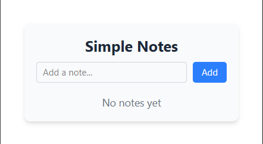
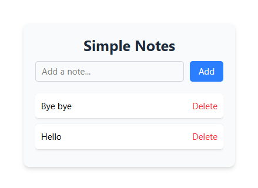

# Simple Notes - Chrome Extension

A lightweight Chrome extension for taking quick notes while browsing. This project was created as a learning exercise to understand Chrome extension development.

## Demo

### Empty State


### With Example Notes


## Features

- Create and save quick notes while browsing
- Simple and intuitive user interface
- Notes persist across browser sessions
- Built with modern web technologies (TypeScript, Vite)

## Tech Stack

- TypeScript
- Vite (for build tooling)
- Chrome Extension APIs
- CSS for styling

## Development

To run this project locally:

1. Clone the repository
2. Install dependencies:
   ```
   npm install
   ```
3. Build the extension:
   ```
   npm run build
   ```
4. Load the extension in Chrome:
   - Open Chrome and navigate to `chrome://extensions/`
   - Enable "Developer mode"
   - Click "Load unpacked"
   - Select the `dist` directory from this project

## Project Structure

```
simple-notes/
├── src/              # Source code
├── public/           # Static assets
├── dist/            # Build output
└── manifest.json    # Extension manifest
```

## Learning Outcomes

This project provided hands-on experience with:
- Chrome Extension Development
- TypeScript
- Browser Storage APIs
- Build tooling with Vite
- Web Extension Manifest V3

## License

This project is open source and available under the MIT License.
